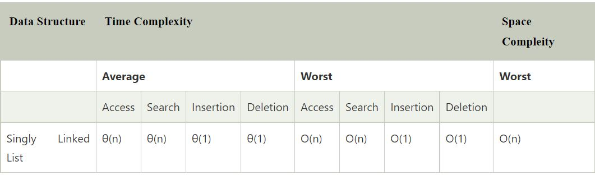

# Linked List
A linked list is a sequence of data structures, which are connected together via links.

Linked List is a sequence of links which contains items. Each link contains a connection to another link. Linked list is the second most-used data structure after array. Following are the important terms to understand the concept of Linked List.

- **Link -** Each link of a linked list can store a data called an element.
- **Next -** Each link of a linked list contains a link to the next link called Next.
- **LinkedList -** A Linked List contains the connection link to the first link called First.

## Linked List Representation
Linked list can be visualized as a chain of nodes, where every node points to the next node.

## Uses of Linked List
- The list is not required to be contiguously present in the memory. The node can reside any where in the memory and linked together to make a list. This achieves optimized utilization of space.
- list size is limited to the memory size and doesn't need to be declared in advance.
- Empty node can not be present in the linked list.
- We can store values of primitive types or objects in the singly linked list.

## Basic Operations
Following are the basic operations supported by a list.

- **Insertion −** Adds an element at the beginning of the list.
- **Deletion −** Deletes an element at the beginning of the list.
- **Display −** Displays the complete list.
- **Search −** Searches an element using the given key.
- **Delete −** Deletes an element using the given key.

## Complexity

## Types of Linked List

### 1) Singly Linked List
It is the commonly used linked list in programs. If we are talking about the linked list, it means it is a singly linked list. The singly linked list is a data structure that contains two parts, i.e., one is the data part, and the other one is the address part, which contains the address of the next or the successor node. The address part in a node is also known as a pointer.

Suppose we have three nodes, and the addresses of these three nodes are 100, 200 and 300 respectively. The representation of three nodes as a linked list is shown in the below figure:

The linked list, which is shown in the above diagram, is known as a singly linked list as it contains only a single link. In this list, only forward traversal is possible; we cannot traverse in the backward direction as it has only one link in the list.

### 2) Doubly Linked List

As the name suggests, the doubly linked list contains two pointers. We can define the doubly linked list as a linear data structure with three parts: the data part and the other two address part. In other words, a doubly linked list is a list that has three parts in a single node, includes one data part, a pointer to its previous node, and a pointer to the next node.

Suppose we have three nodes, and the address of these nodes are 100, 200 and 300, respectively. The representation of these nodes in a doubly-linked list is shown below:

As we can observe in the above figure, the node in a doubly-linked list has two address parts; one part stores the address of the next while the other part of the node stores the previous node's address. The initial node in the doubly linked list has the NULL value in the address part, which provides the address of the previous node.

### 3) Circular Linked List

A circular linked list is a variation of a singly linked list. The only difference between the singly linked list and a circular linked list is that the last node does not point to any node in a singly linked list, so its link part contains a NULL value. On the other hand, the circular linked list is a list in which the last node connects to the first node, so the link part of the last node holds the first node's address. The circular linked list has no starting and ending node. We can traverse in any direction, i.e., either backward or forward. The diagrammatic representation of the circular linked list is shown below:

### 4) Doubly Circular Linked List

The doubly circular linked list has the features of both the circular linked list and doubly linked list.

The above figure shows the representation of the doubly circular linked list in which the last node is attached to the first node and thus creates a circle. It is a doubly linked list also because each node holds the address of the previous node also. The main difference between the doubly linked list and doubly circular linked list is that the doubly circular linked list does not contain the NULL value in the previous field of the node. As the doubly circular linked contains three parts, i.e., two address parts and one data part so its representation is similar to the doubly linked list.

